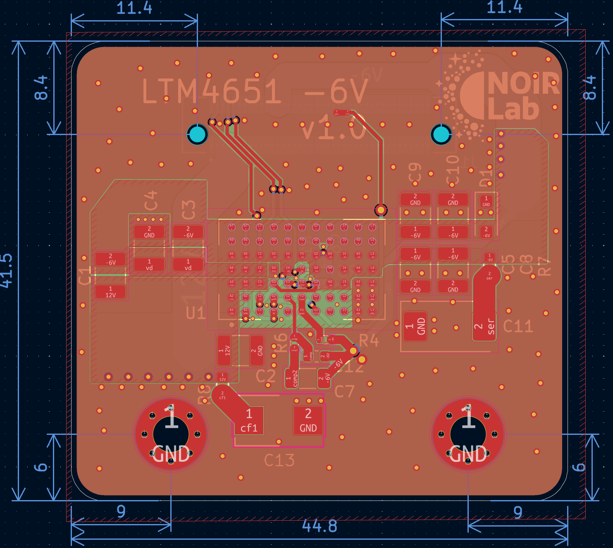
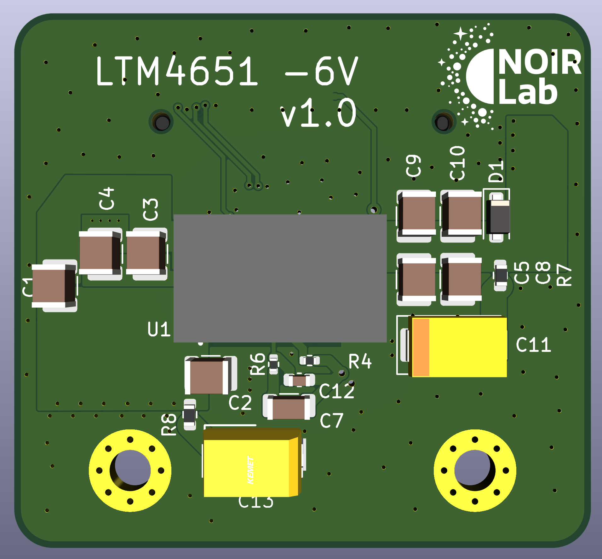

# mdc-power-n6-umodule
Modular Detector Controller Power -6V uModule Mezzanine Module

## Overview
12V input to -6V output DC-DC module, 3A nominal output, used as one of the `mdc-power-*` bias rails.
Designed for 2 MHz sync operation.
Mezzanine module.

## Power Stage
- Controller: `LTM4651` (uModule)
  - Integrated µModule regulator including controller, MOSFETs, inductor, and support components.
  - EN55022B compliant regulator family (meets Class B EMI limits for conducted and radiated emissions).
  - External sync capability.

## Files
- Schematic: `power_n6_umodule.pdf`

## Board Dimensions
- 44.8 mm x 41.5 mm

## Board Stackup
- 4-layer PCB

## CAD
- Designed using KiCad 9.

## Interface
- Control pins: `EN` (enable) and `PG` / `~PGOOD` (power good).
- Connector: `LSHM-140-04.0-L-DV-A-N-K-TR` (Samtec LSHM series) mezzanine for power and control signals.
  - Common pinout is shared across the 16V, -16V, 6V, and 3.3V variants.
  - Unused output rails are tied to GND on the specific module variant.

## Images
Layout:

3D view:

## License

This hardware design is licensed under the **Creative Commons Attribution-NonCommercial-ShareAlike 4.0 International License** (CC BY-NC-SA 4.0).

You are free to download, modify, and build upon this design for your own research or personal use, provided you give appropriate credit and share your modifications under the exact same license. **Commercial manufacturing or use of these designs is strictly prohibited without explicit permission.**

To view a copy of this license, visit [http://creativecommons.org/licenses/by-nc-sa/4.0/](http://creativecommons.org/licenses/by-nc-sa/4.0/) or see the `LICENSE` file in this repository.